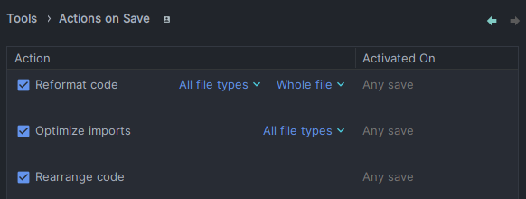

# Cấu trúc thư mục dự án

```bash
src
├───main
│   ├───java
│   │   └───shop
│   │       └───haui_megatech
│   │           ├───annotation
│   │           ├───configuration
│   │           │   ├───cache
│   │           │   ├───documentation
│   │           │   ├───language
│   │           │   └───security
│   │           │       └───filter
│   │           ├───constant
│   │           ├───controller
│   │           ├───domain
│   │           │   ├───dto
│   │           │   │   ├───authentication
│   │           │   │   ├───brand
│   │           │   │   ├───cart
│   │           │   │   ├───common
│   │           │   │   ├───image
│   │           │   │   ├───order
│   │           │   │   ├───order_detail
│   │           │   │   ├───pagination
│   │           │   │   ├───product
│   │           │   │   └───user
│   │           │   ├───entity
│   │           │   └───mapper
│   │           │       └───impl
│   │           ├───exception
│   │           ├───job
│   │           ├───log
│   │           ├───repository
│   │           ├───service
│   │           │   ├───base
│   │           │   └───impl
│   │           ├───utility
│   │           └───validator
│   └───resources
│       ├───i18n
│       ├───META-INF
│       ├───sql
│       └───template
└───test
    └───java
        └───shop
            ├───hauimegatech
            └───haui_megatech
                ├───controller
                ├───domain
                │   └───mapper
                └───order
```

# Cấu trúc các thư mục:

- aspect: chứa các file thực hiện cho các thao tác logging hệ thống, phục vụ cho việc logging activity, benchmark query
  and execution time performance
- base: chứa các cấu hình cho các phiên bản api, cấu hình một lớp ResponseEntity để tái sử dụng nhiều lần
- config: chứa các config cho ứng dụng: mail, cloudiry, swagger, code run right after project start up
- constant: chứa giá trị của các api requests, message, ...
- controller: chứa các handler method mapping từ HTTP method url
- domain:
    - dto: chứa các class phục vụ cho việc vận chuyển dữ liệu (chọn lọc ra những dữ liệu muốn return cho người dùng)
        - common: chứa các DTO response hay được sử dụng như kiểu dữ liệu trả về cho các phương thức
        - pagination: chứa các DTO request, response phục vụ cho việc lấy nhiều bản ghi có phân trang
    - entity: chứa các thực thể
    - mapper: chứa các file mapping từ plain object -> data transfer object và ngược lại
- jobs: chứa các task lên lịch tự động thực hiện
- repository: chứa các file dùng để query tới CSDL
- security: chứa các file config bảo mật và phân quyền các api endpoints
- service: chứa các file thực hiện xử lý các logic nghiệp vụ
- util: chứa các file thuần về xử lí logic, validate dữ liệu, convert dữ liệu, ...
- resources:
    - i18n: chứa các message được bind tới bởi các file trong lớp constant, phục vụ cho vấn đề đa ngôn ngữ
    - static: chứa các file tĩnh như js, css, ...
    - templates: chứa các file được tích hợp template engine để render ra thêm dữ liệu trong quá trình chạy chương trình

# Luồng code ra thêm một entity mới

Bước 1: Định nghĩa model ở package: /domain/entity

Bước 2: Định nghĩa data transfer object cho model vừa định nghĩa ở package: /domain/dto

Bước 3: Định nghĩa mapper class thực hiện mapping từ plain pojo object -> data transfer object tại package:
/domain/mapper

Bước 4: Định nghĩa ra các record (nếu cần) chứa request và response cần thiết cho lớp vừa tạo ở package: /domain/dto

Bước 5: Định nghĩa repository interface cho model vừa tạo tại package: /repository

Bước 6: Định nghĩa service interface và lớp implements lại interface đó tại package: /service

Bước 7: Định nghĩa controller class thực hiện bắt các request và sử dụng các xử lí nghiệp vụ đã cài đặt ở service
interface

# Cách để đồng bộ format code của nhóm:

Settings (3 dots icon) -> Editor -> Code Style -> Java -> Import Scheme (3 dots icon) -> IntelliJ IDEA Code Style XML ->
GlobalFormat.xml

Và config thêm cái này: Settings -> Tools -> Actions on Save

